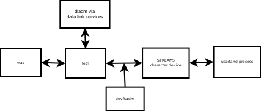

**Overview**

This IPD describes a proposed new feature for illumos: a virtual GLDv3 network device through which a userland process can send and receive frames. Analogs for this device exist on other platforms: TAP (Linux, Solaris and some BSDs), feth (recent Darwins). Virtual devices of this nature are commonly used by virtual networking software such as OpenVPN or ZeroTier. The current working name of the device is _feth_ for "faux ethernet". It is modelled in large part on the  existing _simnet_ device and shares a significant amount of code with _simnet_.

**Current State**

A working proof of concept is available and has been tested on omnios r32 and 34. Functionality works in the GZ, and with multiple devices present on a given system. If the apropriate privileges are granted, feth devices can be managed in a NGZ and are not visible outside the zone. Attempts to enable flow control cause drastic performance drops and it's unclear if the STREAMS flow control mechanism is working in the expected way. A patch for ZeroTier (ZT) successfully permits an omnios node to join a ZT network.

While at least partly functional, the code is not currently ready for integration. There are numerous cstyle compliance warnings and notes to the author, not to mention bugs lurking everywhere. The hope is that a lively discussion can occur in order to influence the design and "guide the code" toward its ultimate integration, should that be deemed worthwhile.

**Description of use in practice**

1.  The _feth_ device is created using _dladm create-feth_.
2.  DLS triggers a new device device to be created. A character device node is created for the device and linked in /dev/feth by _devfsadm_.
3.  The device is plumbed and configured using the usual tools, such as _ifconfig_ and _ipadm_.
4.  The character device is opened and MAC layer frames are exchanged using _read()_ \[1\] and _write()_ or the appropriate STREAMS functions. Frames are only passed when the character device is opened, otherwise the link is "down" and outbound frames are dropped.
5.  The device may be deleted using _dladm delete-feth_ when it is no longer needed.
6.  DLS triggers the device to be removed. If no processes are using the character device, the device driver removes the interface and the corresponding character device node. The symbolic link in /dev/feth is removed by _devfsadm_.

The link status of a _feth_ interface is considered "UP" when the _feth_ character device has been opened by a process and "DOWN" when no processes have the character device open. When the device is down, frames are dropped in order to prevent unnecessary loading of the STREAMS queues.

**Components impacted**

  

*   feth driver (new, usr/src/uts/common/io/feth)
*   dld
*   dladm
*   libdladm
*   devfsadm
*   Additionally, dls and truss have minor changes.

**Management of feth devices**

The following options will be added to _dladm_ for managing _feth_ devices. These correspond almost completely with those of the _simnet_ subcommands, with the exception of the -s and -m options to _create-feth_.

    create-feth   [-t] [-s] [-R <root-dir>] [-m <mac address>] <feth-link>
        -t: create a temporary device that will not survive system restart (temporary)
        -s: create a device that will be removed as soon as the interface's character device is closed (single-shot, see section X below)
        -m: specify a mac address for the interface
        -R: operate on a particular system root directory

    delete-feth   [-R <root-dir>] <feth-link>
        -R: operate on a particular system root directory

    show-feth     [-p] [-o <field>,...] [-P] [<feth-link>]
        -p: generate machine parsable output (must be used in conjunction with -o)
        -o: specify the fields to include in output: link, macaddress
        -P: show persistent devices, whether active or not

     up-feth       <feth-link>

**Known open questions**

_Promiscuous mode_: some applications require promiscuous mode to be enabled. This can effectively be enabled within the driver, for example using an _ioctl()_, however the state of the interface can not be reported up. It appears that DLPI would need to be used by an application in order to propagate the promiscuous status. What's the best solution here?

_Flow control_: it seems logical that flow control on the character device should be implemented in order to prevent a slow character device reader from causing memory usage to balloon. However this seems to cause a precipitous drop (several orders of magnitude) in performance regardless of the settings of the device water marks or mechanism used to re-enable data transfer. Is the source of this behavior sub-optimal watermark settings between the character device and the stream head?

_Driver "double-duty"_: the _feth_ driver has two personalities: acting as a mac device or a character device depending on the node being operated on. Because a device driver can only supply 1 set of callback functions, it is up to the driver to decide which set of functionality to invoke. The current proof-of-concept code sets a magic cookie value at the beginning of the data passwd to the device callbacks. The callbacks look for the presence of this value and invoke the mac callbacks when it is not present. This approach has worked in testing and it seems unlikely to cause a problem, as 1) the minimum length of the struct passed to the callback by mac is well over the length of the magic cookie and 2) it seems highly unlikely that a mac device's struct would inadvertently collide. However, it seems ugly and perhaps a better approach can be found.

**What this proposal does not attempt to do**

**API compatibility**

The TAP driver bundled with some illumos distributions is based on code written circa 2000 by Maxim Krasnyansky and subsequently enhanced by Kazuyoshi Aizawa. This driver has also been ported to Linux and BSD. This driver is not based on the GLDv3 (mac) framework. The driver does not include a utility for creating persistent interfaces, though a GPL licensed utility exists. A brief review of code suggests that the details of interacting with the driver is different in each environment. For example: on illumos, the device created is configured by pushing a series of STREAMS modules. Some applications may require using DLPI to configure the interface for things such as promiscuous mode.

The proposed API will be much closer to the Linux and BSD interfaces in terms of frame interchange. The configuration and teardown of feth interface will be different from both the existing TAP driver and that of the driver on other platforms. Overall, however, creating and using a _feth_ device should be greatly simplified compared to the current situation and attempts to hew as closely to "illumos style" as practicable.

**"Single-shot" mode**

The existing TAP driver operates as a clone device. An inherent feature of this is that unless the STREAMS configuration is permanently linked, it will be destroyed automatically if the major device (/dev/tap) is closed. This is a useful behavior should, a program creating a TAP device abort without a clean shutdown.

The proposal seeks to use DLS (data-link services), and it does not appear that a clean interface destruction from the driver side is possible: the device can be destroyed but DLS will not be aware of this fact.

**TUN Driver**

The functionality provided by the proposed replacement for the TAP driver is frequently discussed in conjuction wih that of the TUN driver, which is essentially an analogue of the TAP driver operating strictly in terms of IP. That is, a TUN device exchanges layer 4 IP protocol data with the userland process rather than layer 3 ethernet mac data.

The TUN driver provided provided with some illumos distributions is generated from the TAP driver source by switching a small amount of code using preprocessor defines.

Providing a replacement for the TUN driver is not currently in-scope for this proposal. Should analysis reveal that a replacement for the TUN portion of the TAP/TUN driver is desirable by following the TAP/TUN approach, this proposal could provide the bulk of the code required. It should be noted that there currently exists an IP tunnel driver within illumos that behaves in a different way and solves a different problem. At a minimum, this name clash would need to be addressed.

**Zones**

The sys\_dl\_config privilege is required to manage feth devices. If a zone is granted this privilege, it is possible to create feth devices inside of a zone.

Some additional work wrt tooling will probably be required for an initial release: currently if a feth device is created in a zone, upon shutdown/restart of the zone, a fault occurs because the feth device still exists. On SmartOS, restarting a zone with a simnet or feth device causes a kernel panic due to a failed assertion.

Secondly, the devfsadm integration for managing the feth character device works only in the global zone. In theory mknod can be used if the privilege PRIV\_SYS\_DEVICES is granted, however this does not appear possible through smartos or omnios tooling. Without a character device, traffic cannot traverse the interface.

Question: are modifications using dladm in a NGZ expected to work? It seems that at lease some devices can be created and ought to work; subject to the caveats vis-a-vis zone lifecycle tooling.

Another approach to avoiding the problem with /dev/feth/\* devices would be for /dev/net devices to serve the character device role; posibly when an ioctl() is received requesting the mode change. If even feasible, this would come at the cost of tangled code with unforeseen problems.

**WIP Code**

[http://bill.welliver.org/dist/webrevs/feth-prototype/](http://bill.welliver.org/dist/webrevs/feth-prototype/)

[https://git.sr.ht/~hww3/illumos-omnios](https://git.sr.ht/~hww3/illumos-omnios)

\[1\] An application may wish to set the _RMSGN_ flag on the _I\_SRDOPT_ ioctl in order to ensure that multiple frames are not coalesced into a single _read()_.
